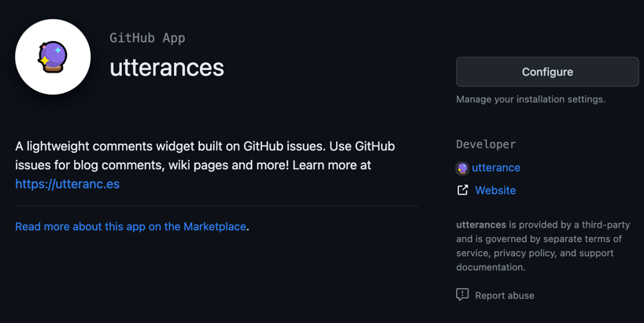
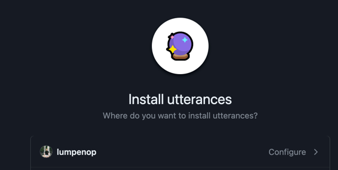
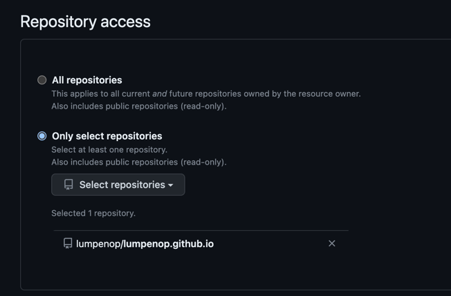

`---
categories: [GitHub, GitHub Pages]
tags: [GitHub, Pages]
---

### 블로그 설정
GitHub Pages 는 저장소를 웹으로 띄워주는 것이라
다른 설정들을 직접 해줘야 한다

#### Chirpy 테마 설정

Chirpy 테마에는 댓글 기능이 없기 때문에
utterances 를 사용하여 댓글 기능을 추가해준다

https://github.com/apps/utterances
에 접속 후 

Configure 를 클릭 

원하는 저장소를 선택하여 등록한다

댓글을 저장소 issues 에 등록하는 것이기 때문에

등록하는 저장소에 issues 탭이 있어야 댓글 등록이 된다

때문에 댓글 사용자는 깃허브 아이디로 로그인을 해야 한다

_layouts/post.html 최 하단에 바깥 영역에
utterances 설정에서 나온 html 코드를 복붙한다

